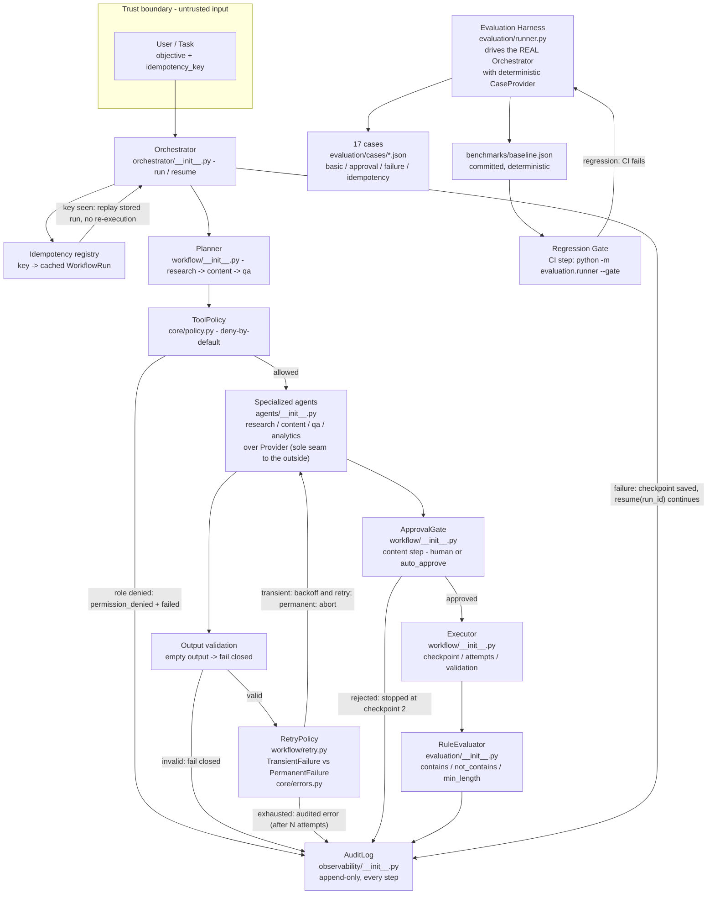

# Architecture

## Layering

```
Objective
   │
   ▼
Planner ──────────────▶ WorkflowPlan (ordered roles)
   │
   ▼
Executor
   ├── ToolPolicy ──────▶ permission check (deny-by-default)
   ├── RetryPolicy ─────▶ retry transient failures with backoff
   ├── ApprovalGate ────▶ human gate before irreversible work
   └── Checkpoint ──────▶ resume from the last completed step
   │
   ▼
Specialized agents ────▶ Research → Content → QA (Provider seam)
   │
   ▼
Evaluation ────────────▶ deterministic rule scoring (offline)
   │
   ▼
AuditLog ──────────────▶ append-only trace + operational summary
```

## Key interfaces

- **`Provider.complete(system, user, temperature) -> str`** — the only seam to
  the outside world. Swap OpenAI, local models, or a fake for tests.
- **`Agent.run(task) -> AgentResult`** — every agent returns a validated result
  with `passed_validation` and notes.
- **`ToolPolicy.allows(role) -> bool`** — the permission gate every dispatch
  passes through; unknown roles are denied.
- **`RetryPolicy.run(fn, sleep, retryable)`** — classifies and retries
  `TransientFailure`; permanent failures abort.
- **`KnowledgeBase.search(query, top_k) -> [Document]`** — retrieval is an
  interface, not an implementation.
- **`Evaluator.evaluate(run) -> EvaluationResult`** — deterministic, offline,
  rule-based quality scoring.
- **`AuditLog.record(...)` / `AuditLog.summarize(run)`** — append-only trace
  plus one-line operational status, metrics, and retry counts.

## State machine

```
pending → planning → running → awaiting_approval → approved → completed
                          │            │
                          ▼            ▼
                        failed      rejected
```

`failed` runs keep a checkpoint, so `Orchestrator.resume(run_id)` continues
from the last completed step without redoing work.

## Idempotency and execution state

- Every `run(objective, idempotency_key=...)` stores its audited run; a replay
  with the same key returns the original run object — no re-execution.
- `WorkflowRun` carries `checkpoint`, `attempts`, `retries`, `metrics`, and
  `plan`, all of which surface in `to_dict()` and `AuditLog.summarize()`.

## Diagram

Source: [diagrams/ai-agent-platform.mmd](diagrams/ai-agent-platform.mmd)
(rendered inline for GitHub; edit the `.mmd`, regenerate with `mmdc`).



## Evidence map (diagram -> code)

| Component | Module | What it proves | Evidence |
| --- | --- | --- | --- |
| Orchestrator | `orchestrator/__init__.py` `run`/`resume` | idempotency replay, resume from checkpoint | `tests/test_platform.py` |
| Planner | `workflow/__init__.py` `Planner` | plan is research -> content -> qa | `EVAL-001..017` plan assertions |
| ToolPolicy | `core/policy.py` | deny-by-default for unknown roles | `EVAL-005` permission_denied |
| Agents | `agents/__init__.py` | specialized roles over a single `Provider` seam | `tests/test_productization.py` |
| RetryPolicy | `workflow/retry.py` | transient retried, permanent aborts, exhausted fails | `EVAL-011/012/013` |
| ApprovalGate | `workflow/__init__.py` | content gate exercised once, decision reflected | `EVAL-007..010` |
| RuleEvaluator | `evaluation/__init__.py` | deterministic offline scoring | `EVAL-003/004` |
| AuditLog | `observability/__init__.py` | every step mirrored in audit | `auditability` 13/13 |
| Harness + gate | `evaluation/runner.py` + `.github/workflows/ci.yml` | real runs vs committed baseline | `benchmarks/baseline.json` 17/17 |

## See also

- [Methodology](methodology.md)
- [Productization notes](productization.md)
- [Roadmap](../ROADMAP.md)
